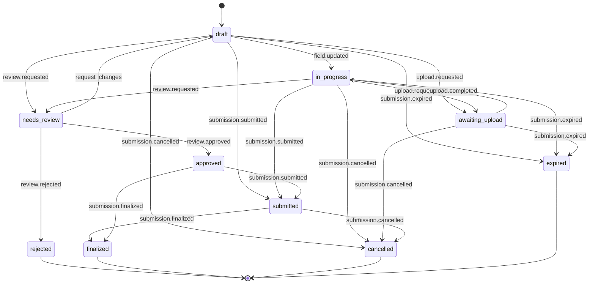

# Core Concepts

FormBridge is a mixed-mode agent-human form submission system. AI agents create submissions, fill the fields they know, and hand off to humans via resume URLs to complete the rest — with field-level attribution tracking throughout.

## Intake Definition

An intake is a template for data collection. Every intake has a unique `id`, a `version`, and defines:

- **Schema** — the fields to collect, expressed as JSON Schema, Zod, or OpenAPI (normalized to a common IR by `@formbridge/schema-normalizer`)
- **Approval Gates** — optional reviewer configuration requiring human sign-off before finalization
- **Destination** — where to deliver finalized submissions (webhook, callback, or queue)
- **TTL** — optional time-to-live after which incomplete submissions expire

```json
{
  "id": "vendor-onboarding",
  "version": "1.0.0",
  "name": "Vendor Onboarding",
  "schema": { "type": "object", "properties": { ... } },
  "approvalGates": [{ "name": "compliance-review", "reviewers": ["reviewer_1"] }],
  "destination": { "kind": "webhook", "url": "https://example.com/hook" },
  "ttlMs": 86400000
}
```

## Submission State Machine

Every submission moves through a state machine. States are enforced — invalid transitions throw `InvalidStateTransitionError`.



### States

| State | Description |
|-------|-------------|
| `draft` | Initial state. Fields can be set by agents or humans. |
| `in_progress` | At least one field has been updated. |
| `awaiting_upload` | A file upload has been requested and is pending confirmation. |
| `submitted` | All required fields are complete; submission is being processed. |
| `needs_review` | Submission has approval gates and is waiting for reviewer action. |
| `approved` | A reviewer approved the submission. Proceeds to `submitted` or `finalized`. |
| `rejected` | A reviewer rejected the submission. **Terminal state.** |
| `finalized` | Submission was delivered to its destination. **Terminal state.** |
| `cancelled` | Submission was explicitly cancelled. **Terminal state.** |
| `expired` | TTL elapsed before completion. **Terminal state.** |

### Terminal States

`rejected`, `finalized`, `cancelled`, and `expired` have no outgoing transitions. Once a submission reaches a terminal state, it is immutable.

## Actor Model

Every action in FormBridge is attributed to an **Actor** — the entity performing the operation.

```json
{
  "kind": "agent",
  "id": "openai-assistant-42",
  "name": "Onboarding Bot"
}
```

| Kind | Description |
|------|-------------|
| `agent` | An AI agent or automated system (e.g. an MCP client, API caller). |
| `human` | A person interacting via the form renderer or admin dashboard. |
| `system` | Internal FormBridge operations (e.g. expiry scheduler, delivery engine). |

Actors are attached to every event and every field attribution record, providing a complete audit trail of who did what.

## Field Attribution

FormBridge tracks **which actor filled each field** via the `fieldAttribution` map on every submission. When a field is set, its attribution is recorded or updated.

```json
{
  "fields": {
    "companyName": "Acme Corp",
    "taxId": "12-3456789",
    "contactEmail": "alice@acme.com"
  },
  "fieldAttribution": {
    "companyName": { "kind": "agent", "id": "onboarding-bot" },
    "taxId": { "kind": "human", "id": "alice@acme.com" },
    "contactEmail": { "kind": "agent", "id": "onboarding-bot" }
  }
}
```

This enables:

- **Audit trails** — see exactly which fields an agent pre-filled vs. which a human completed
- **Trust scoring** — reviewers can flag agent-filled fields for extra scrutiny
- **Handoff UX** — the form renderer highlights who filled each field with `ActorBadge` components

## Triple-Write Pattern

Every state-changing operation in `SubmissionManager` uses the **triple-write pattern** to ensure data consistency across three stores:

1. **Submission events array** — `submission.events.push(event)` appends the event to the in-memory submission object
2. **Event fan-out** — `BridgingEventEmitter.emit(event)` notifies listeners (e.g. `WebhookManager`) and `EventStore.appendEvent(event)` persists to the append-only event store (run in parallel)
3. **Submission store** — `SubmissionStore.save(submission)` persists the updated submission

```
recordEvent(submission, event)
  ├─ submission.events.push(event)
  ├─ Promise.all([
  │    eventEmitter.emit(event),
  │    eventStore.appendEvent(event)
  │  ])
  └─ store.save(submission)
```

This pattern ensures that events are never lost — they exist in the submission's own event list, in the global event store for queries, and are broadcast for real-time processing.

::: warning
Do not add additional listeners that duplicate `EventStore` writes. The triple-write already handles event persistence.
:::

## Resume Token Lifecycle

Each submission has a `resumeToken` — an opaque string that serves as both a capability token and a concurrency guard.

**Key behaviors:**

- **Rotation on every state change** — every time a field is set, a state transition occurs, or an approval action is taken, the resume token is rotated to a new random value
- **Required for mutations** — all write operations (`setFields`, `submit`, `approve`, `reject`, `requestChanges`) require the current resume token
- **Stale token rejection** — if the provided token does not match the current token, the request is rejected with `invalid_resume_token`
- **Handoff URLs** — `POST /submissions/:id/handoff` returns a URL containing the current token, enabling secure agent-to-human transfer

```
Agent creates submission → gets token_1
Agent sets fields        → gets token_2 (token_1 is now invalid)
Agent requests handoff   → URL contains token_2
Human opens resume URL   → uses token_2 to load submission
Human sets fields        → gets token_3 (token_2 is now invalid)
```

This ensures that only the latest token holder can modify the submission, preventing conflicts when multiple parties are involved.

## Approval Gates

Intakes can define one or more **approval gates** — review checkpoints that must be cleared before a submission can be finalized.

```json
{
  "approvalGates": [
    {
      "name": "compliance-review",
      "reviewers": ["reviewer_1", "reviewer_2"],
      "requiredApprovals": 1,
      "escalateAfterMs": 86400000
    }
  ]
}
```

When a submission with approval gates is submitted, it transitions to `needs_review` instead of `submitted`. A reviewer can then:

| Action | Transition | Description |
|--------|-----------|-------------|
| **Approve** | `needs_review` → `approved` | Submission proceeds to finalization. |
| **Reject** | `needs_review` → `rejected` | Submission is permanently rejected (terminal). |
| **Request Changes** | `needs_review` → `draft` | Submission returns to draft with field-level comments for the submitter to address. |

Each action records a `ReviewDecision` with the actor, timestamp, and any comments or reasons.

## Idempotency Keys

Submission creation supports an optional `idempotencyKey` field. If a create request includes an idempotency key that has already been used for the same intake, the existing submission is returned instead of creating a duplicate.

```json
{
  "actor": { "kind": "agent", "id": "bot-1" },
  "initialFields": { "name": "Acme" },
  "idempotencyKey": "agent-session-abc-attempt-1"
}
```

This is useful for agent retries and network failures — the agent can safely retry a create request without producing duplicate submissions.

## Event Stream

Every action produces an immutable **IntakeEvent** that is appended to the submission's event stream. Events are the source of truth for what happened and when.

```json
{
  "eventId": "evt_k7x9m2",
  "type": "field.updated",
  "submissionId": "sub_abc123",
  "ts": "2025-01-15T10:30:00Z",
  "actor": { "kind": "agent", "id": "onboarding-bot" },
  "state": "in_progress",
  "version": 3,
  "payload": {
    "diffs": [
      { "fieldPath": "companyName", "previousValue": null, "newValue": "Acme Corp" }
    ]
  }
}
```

### Event Types

| Event Type | Trigger |
|-----------|---------|
| `submission.created` | New submission created |
| `field.updated` | Single field changed |
| `fields.updated` | Multiple fields changed in one operation |
| `validation.passed` | Schema validation succeeded |
| `validation.failed` | Schema validation found errors |
| `upload.requested` | File upload URL generated |
| `upload.completed` | File upload confirmed |
| `upload.failed` | File upload failed |
| `submission.submitted` | Submission submitted for processing |
| `review.requested` | Submission entered approval queue |
| `review.approved` | Reviewer approved submission |
| `review.rejected` | Reviewer rejected submission |
| `delivery.attempted` | Webhook delivery attempted |
| `delivery.succeeded` | Webhook delivery succeeded |
| `delivery.failed` | Webhook delivery failed |
| `submission.finalized` | Submission fully processed and delivered |
| `submission.cancelled` | Submission cancelled |
| `submission.expired` | Submission expired due to TTL |
| `handoff.link_issued` | Resume URL generated for handoff |
| `handoff.resumed` | Human opened a resume URL |
| `step.started` | Wizard step started |
| `step.completed` | Wizard step completed |
| `step.validation_failed` | Wizard step validation failed |

Events can be queried via `GET /submissions/:id/events` with filters for type, actor kind, and time range. They can also be exported in JSON or JSONL format for external processing.
